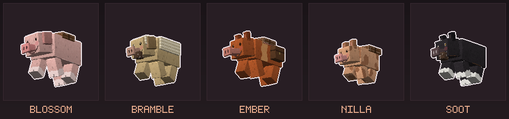

# Snuffle Pigs

Minecraft **Bedrock**-tillägg: fem handgjorda grisar som **söker**. Systerprojekt
till [Loyal Companions](https://loyal.pelleops.se) (hundar) och
[Purrfect Companions](https://purrfect.pelleops.se) (katter) — samma maskineri,
annat djur och ett annat verb.

Minecraft har redan en gris. Den finns för att bli fläsk, och att rida den med
morot på pinne går knappt att styra. Det här paketet ger grisen ett jobb: den
**nosar upp malm genom berget** och säger åt vilket håll den ligger, den **bökar
upp tryfflar** ur jorden, och sadlad går den att **styra på riktigt**.



## De fem

| Namn | Ras | Näsa | Fart | Liv | Bor i |
|------|-----|------|------|-----|-------|
| Nilla | Kunekune | 6 block | 0,26 | 14 | slätter |
| Bramble | Ullgris (mangalitsa) | 7 block | 0,24 | 20 | taiga |
| Blossom | Lantras (large white) | 5 block | 0,22 | 24 | slätter |
| Soot | Berkshire | **12 block** | 0,25 | 18 | skog |
| Ember | Tamworth | 8 block | **0,32** | 16 | savann |

Skillnaderna är inte pynt. Soot känner malm dubbelt så långt som Blossom, och
Blossom bär mest och tål mest — man väljer gris efter uppgift, inte efter färg.

## Hur man använder dem

- **Tämj** med en morot (fyra gånger av tio per morot).
- **Byt läge** med en pinne i handen: Följ → Böka → Stanna.
- **Böka**: i bökläget gräver grisen upp tryfflar ur jord, gräs, podsol, mycel,
  mossa, lera och rotad jord. Tryffeln syns i trynet ett ögonblick innan den
  faller — så man ser varifrån den kom.
- **Vittring**: i bökläget känner grisen malm genom berget och säger vad den
  känner, åt vilket håll och hur långt bort. Väderstreck och avstånd, inte exakta
  koordinater: den säger vart man ska gräva och låter dig göra resten.
- **Sadla** med en sadel, så går den att rida med full styrning. **Sadelväskor**
  med en kista.
- **Vältra sig.** En gris som hittar lera lägger sig i den och går omkring
  lerig på magen och benen ett tag efteråt. Vatten tvättar av. Det gör
  ingenting nyttigt — det är bara vad grisar gör.
- **Föd upp** med tryffel, potatis eller rödbeta. Kultingen föds redan din.

Tryffeln går att äta och är det bästa avelsfodret — det man hittar har en
användning även när skafferiet är fullt.

## Bygga och testa

```bash
python3 tools/make_pigs.py        # genererar ALLT: modeller, texturer, JSON, språk
python3 tools/render_pigs.py      # publish/pigs.png — se dem utan Minecraft
tools/snuffle-test                # statiska spärrar + skarp Bedrock-server
python3 tools/snuffle-falsifiera  # provar att spärrarna faktiskt faller
```

Ingenting i `SnuffleCompanions_BP/` eller `SnuffleCompanions_RP/` skrivs för
hand — `tools/make_pigs.py` äger dem och skriver om dem från grunden. Redigerar
man en genererad fil försvinner ändringen nästa körning.

Krav på maskinen: en Bedrock-server i `/opt/bds/server` och kattprojektets
`render_regression.py` för PNG-läsning.
